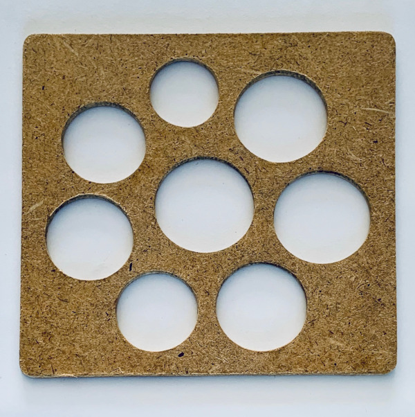

# euro-coins

Ce projet, réalisé pendant le confinement *Covid-19*, se propose d'explorer plusieurs approches pour la fabrication d'un support de pièces euros disposées en cercle autour d'une pièce centrale. Ce projet est aussi l'occasion pour s'initier à quelques logiciels.

_Note de l'auteur : je ne suis attaché à aucune marque, ni à aucun produit testé dans le cadre de ce projet._

**Cahier des charges :**
- La pièce de 2 euros est positionnée au centre
- Les pièces forment un cercle autour de la pièce de 2 euros.
- Les pièces sont équidistantes les unes des autres.

| illustration n°1 | illustration n°2 |
| ---- | ---- |
|  |   |

1. [Expérience 1 : GeoGebra](geogebra/README.md) / niveau novice
   - ressources : [geogebra-euro-coins.ggb](geogebra/geogebra-euro-coins.ggb),  [geogebra-euro-coins.png](geogebra/geogebra-euro-coins.png)
2. [Expérience 2 : Fusion 360](fusion360/README.md) / niveau novice
   - ressource :

## Tableau des pièces

| Pièce | diamètre (mm) | diamètre (mm) avec capsule |
| ---: | ---: | ---: |
| 2 euros | 26.00 | 30.00 |
| 1 euro | 23.00 | 27.00 |
| 50 centimes | 24.50 | 28.50 |
| 20 centimes | 22.50 | 26.50 |
| 10 centimes | 20.00 | 24.00 |
| 5 centimes | 21.50 | 25.50 |
| 2 centimes | 19.00 | 23.00 |
| 1 centime | 16.50 | 20.50 |

_Note: L'utilisation d'une capsule ajoute +4.0mm au diamètre initial de la pièce._
