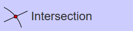
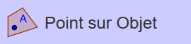
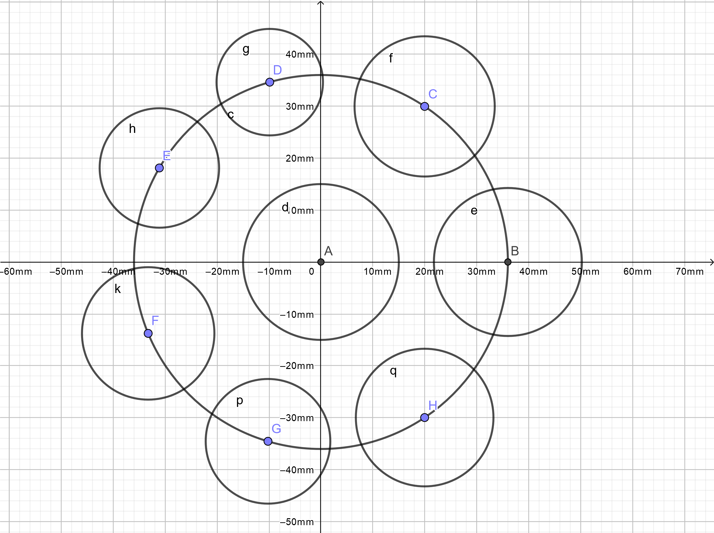
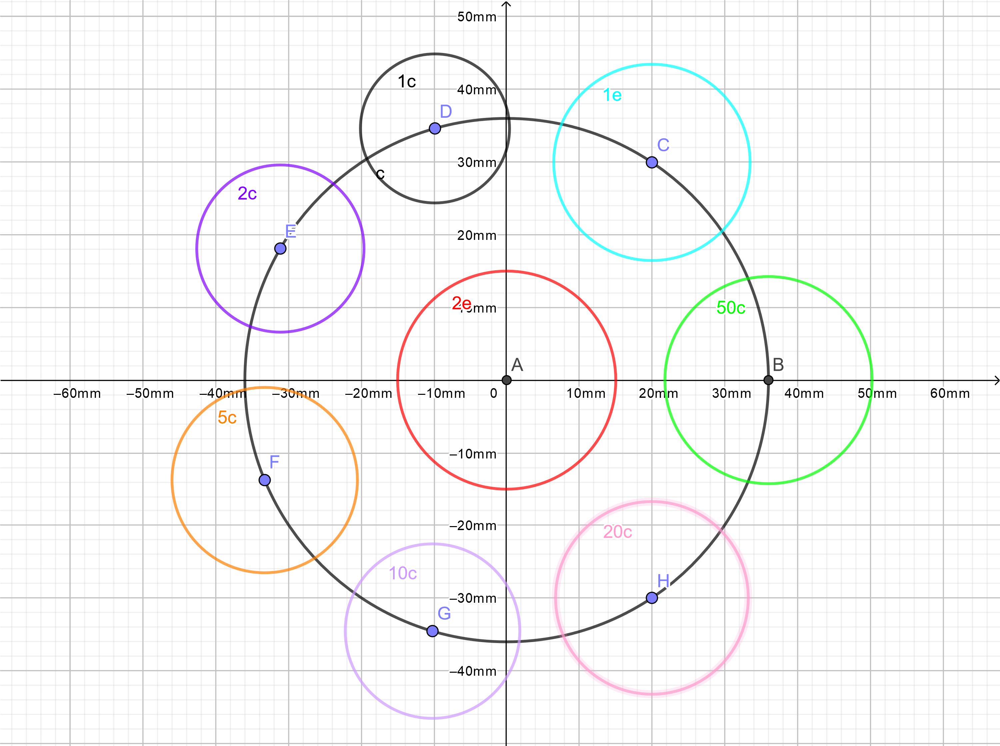

# GeoGebra

Qui a un enfant à l'école a déjà entendu parlé du logiciel **GeoGebra**.

Pour ce projet, j'utilise l'application en ligne [GeoGebra Classique](https://www.geogebra.org/classic) qui ne nécéssite aucune installation sur le poste de travail ni aucun compte utilisateur.

## La Méthode
Dans un premier temps, il s'agit de disposer les différentes pièces autour de la pièce de 2 euros qui sera centrée par rapport aux deux axes puis dans un second temps, d'espacer les pièces de manière régulière pour un meilleur rendu.

## 1. La création des pièces
_Préliminaire : Avant de commencer, il convient de fixer l'unité des axes sur `mm`._

1. Le cercle _**Patron**_

Le cercle _**Patron**_ n'a pour seule utilité que de garantir l'équidistance des différentes pièces vis-à-vis de la pièce de 2 euros ... tels des satellites.

| # | Action | Description |
| ---- | ---- | ---- |
| 01 | .png "Illustration") | Création du cercle `c` de centre `A = (0, 0)` et de rayon `36`. |

2. La pièce de _**2 euros**_

La pièce de _**2 euros**_ est positionnée au centre du dispositif.

| # | Action | Description |
| ---- | ---- | ---- |
| 02 | .png "Illustration") | Création d'un cercle `d` de centre `A = (0, 0)` et de rayon `15`. |

3. La pièce de _**50 centimes**_

La pièce de _**50 centimes**_ est la première pièce dont le centre est un point du cercle _**Patron**_. Dans la figure, le point `B`, centre de ce cercle est également à l'intersection avec l'axe des abscisses (_Ce qui n'est pas une obligation_).

| # | Action | Description |
| ---- | ---- | ---- |
| 03 |  | Création du point d'intersection `b = (36, 0)` entre le cercle _**Patron**_ `c` et l'axe des abscisses. |
| 04 | .png "Illustration") | Création du cercle `e` de centre `B = (36, 0)` et de rayon `14.25`. |

4. La pièce de _**1 euro**_

La pièce de _**1 euro**_ est la première pièce en "gravitation libre" autour de la pièce de _**2 euros**_. Cela signifie qu'en sélectionnant le point `C` et en restant appuyé, vous pouvez faire circuler le cercle `f` sur tout le contour du cercle Patron `c`.

| # | Action | Description |
| ---- | ---- | ---- |
| 05 |  | Création du point `C` appartenant au cercle _**Patron**_ `c` dont les coordonnées sont approximativement `C = (19.97, 29.95)`. |
| 06 | .png "Illustration") | Création du cercle `f` de centre `C = (19.97, 29.95)` et de rayon `13.50`. |

5. La pièce de _**1 centime**_

La construction de la pièce de _**1 centime**_, tout comme les suivantes, est une répétition de la séquence utilisée pour la pièce de  _**1 euro**_.

| # | Action | Description |
| ---- | ---- | ---- |
| 07 |  | Création du point `D` appartenant au cercle _**Patron**_ `c` dont les coordonnées sont approximativement `D = (-9.86, 34.62)`. |
| 08 | .png "Illustration") | Création du cercle `g` de centre `D = (-9.86, 34.62)` et de rayon `10.25`. |

6. La pièce de _**2 centimes**_

| # | Action | Description |
| ---- | ---- | ---- |
| 09 |  | Création du point `E` appartenant au cercle _**Patron**_ `c` dont les coordonnées sont approximativement `E = (-31.12, 18.10)`. |
| 10 | .png "Illustration") | Création du cercle `h` de centre `E = (-31.12, 18.10)` et de rayon `11.50`. |

7. La pièce de _**5 centimes**_

| # | Action | Description |
| ---- | ---- | ---- |
| 11 |  | Création du point `F` appartenant au cercle _**Patron**_ `c` dont les coordonnées sont approximativement `F = (-33.27, -13.75)`. |
| 12 | .png "Illustration") | Création du cercle `k` de centre `F = (-33.27, -13.75)` et de rayon `12.75`. |

8. La pièce de _**10 centimes**_

| # | Action | Description |
| ---- | ---- | ---- |
| 13 |  | Création du point `G` appartenant au cercle _**Patron**_ `c` dont les coordonnées sont approximativement `G = (-10.2, -34.53)`. |
| 14 | .png "Illustration") | Création du cercle `p` de centre `G = (-10.2, -34.53)` et de rayon `12.00`. |

9. La pièce de _**20 centimes**_

| # | Action | Description |
| ---- | ---- | ---- |
| 15 |  | Création du point `H` appartenant au cercle _**Patron**_ `c` dont les coordonnées sont approximativement `H = (19.97, -29.95)`. |
| 16 | .png "Illustration") | Création du cercle `q` de centre `H = (19.97, -29.95)` et de rayon `13.25`. |

A ce stade, la figure doit ressembler à ceci.

## ... _Egayons le schéma_

| # | Action | Description |
| ---- | ---- | ---- |
| 17 |  | Cliquer sur le menu contextuel, puis quand il est affiché, sur la roue dentée. |
| 18 |  | Basculer en mode sélection. |
| 19 | _pièce de **2 euros**_ | Cliquer sur le cercle central `d`. Onglet **Basique** : Saisir `2e` dans la zone **Légende:** Onglet **Couleur** : Choisir la couleur 'rouge'. |
| 20 | _pièce de **50 centimes**_ | Cliquer sur le cercle `e`. Onglet **Basique** : Saisir `50c` dans la zone **Légende:** Onglet **Couleur** : Choisir la couleur 'verte'. |
| 21 | _pièce de **1 euro**_ | Cliquer sur le cercle `f`. Onglet **Basique** : Saisir `1e` dans la zone **Légende:** Onglet **Couleur** : Choisir la couleur 'bleue'. |
| 22 | _pièce de **1 centime**_ | Cliquer sur le cercle `g`. Onglet **Basique** : Saisir `1c` dans la zone **Légende:** Onglet **Couleur** : Choisir la couleur 'noire'. |
| 23 | _pièce de **2 centimes**_ | Cliquer sur le cercle `h`. Onglet **Basique** : Saisir `2c` dans la zone **Légende:** Onglet **Couleur** : Choisir la couleur 'violette'. |
| 24 | _pièce de **5 centimes**_ | Cliquer sur le cercle `k`. Onglet **Basique** : Saisir `5c` dans la zone **Légende:** Onglet **Couleur** : Choisir la couleur 'orange'. |
| 25 | _pièce de **10 centimes**_ | Cliquer sur le cercle `p`. Onglet **Basique** : Saisir `10c` dans la zone **Légende:** Onglet **Couleur** : Choisir la couleur 'violette claire'. |
| 26 | _pièce de **20 centimes**_ | Cliquer sur le cercle `q`. Onglet **Basique** : Saisir `20c` dans la zone **Légende:** Onglet **Couleur** : Choisir la couleur 'rose'. |

La figure ressemble désormais à ceci.

