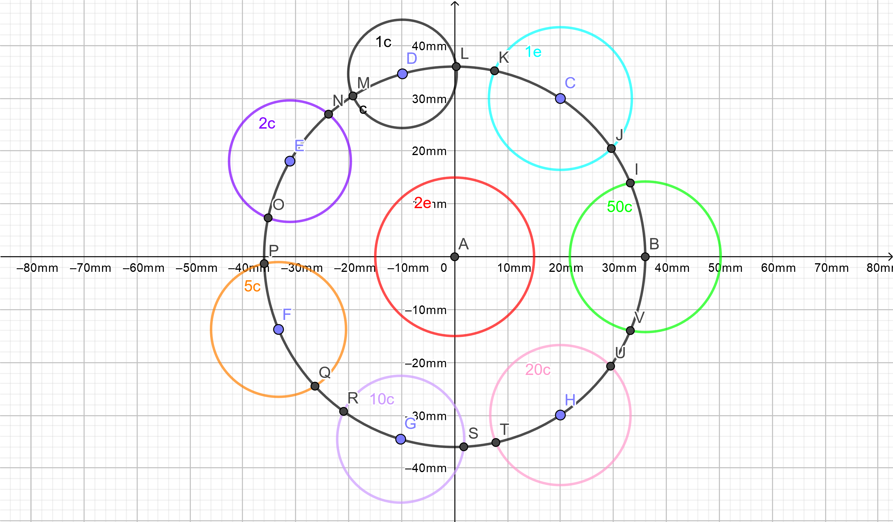
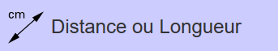
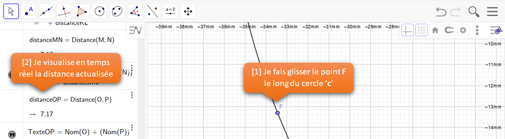
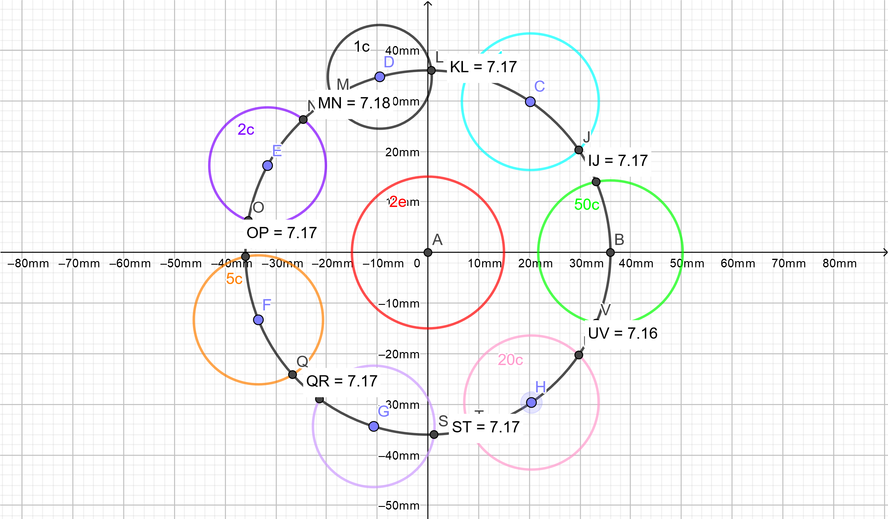

# GeoGebra

Qui a un enfant à l'école a déjà entendu parlé du logiciel **GeoGebra**.

Pour ce projet, j'utilise l'application en ligne [GeoGebra Classique](https://www.geogebra.org/classic) qui ne nécéssite aucune installation sur le poste de travail ni aucun compte utilisateur.

## La Méthode
Dans un premier temps, il s'agit de disposer les différentes pièces autour de la pièce de 2 euros qui sera centrée par rapport aux deux axes puis dans un second temps, d'espacer les pièces de manière régulière pour un meilleur rendu.

## 1. La création des pièces
_Préliminaire : Avant de commencer, il convient de fixer l'unité des axes sur `mm`._

1. Le cercle _**Patron**_

Le cercle _**Patron**_ n'a pour seule utilité que de garantir l'équidistance des différentes pièces vis-à-vis de la pièce de 2 euros ... tels des satellites.

| # | Action | Description |
| ---- | ---- | ---- |
| 01 | .png "Illustration") | Création du cercle `c` de centre `A = (0, 0)` et de rayon `36`. |

2. La pièce de _**2 euros**_

La pièce de _**2 euros**_ est positionnée au centre du dispositif.

| # | Action | Description |
| ---- | ---- | ---- |
| 02 | .png "Illustration") | Création d'un cercle `d` de centre `A = (0, 0)` et de rayon `15`. |

3. La pièce de _**50 centimes**_

La pièce de _**50 centimes**_ est la première pièce dont le centre est un point du cercle _**Patron**_. Dans la figure, le point `B`, centre de ce cercle est également à l'intersection avec l'axe des abscisses (_Ce qui n'est pas une obligation_).

| # | Action | Description |
| ---- | ---- | ---- |
| 03 |  | Création du point d'intersection `b = (36, 0)` entre le cercle _**Patron**_ `c` et l'axe des abscisses. |
| 04 | .png "Illustration") | Création du cercle `e` de centre `B = (36, 0)` et de rayon `14.25`. |

4. La pièce de _**1 euro**_

La pièce de _**1 euro**_ est la première pièce en "gravitation libre" autour de la pièce de _**2 euros**_. Cela signifie qu'en sélectionnant le point `C` et en restant appuyé, vous pouvez faire circuler le cercle `f` sur tout le contour du cercle Patron `c`.

| # | Action | Description |
| ---- | ---- | ---- |
| 05 |  | Création du point `C` appartenant au cercle _**Patron**_ `c` dont les coordonnées sont approximativement `C = (19.97, 29.95)`. |
| 06 | .png "Illustration") | Création du cercle `f` de centre `C = (19.97, 29.95)` et de rayon `13.50`. |

5. La pièce de _**1 centime**_

La construction de la pièce de _**1 centime**_, tout comme les suivantes, est une répétition de la séquence utilisée pour la pièce de  _**1 euro**_.

| # | Action | Description |
| ---- | ---- | ---- |
| 07 |  | Création du point `D` appartenant au cercle _**Patron**_ `c` dont les coordonnées sont approximativement `D = (-9.86, 34.62)`. |
| 08 | .png "Illustration") | Création du cercle `g` de centre `D = (-9.86, 34.62)` et de rayon `10.25`. |

6. La pièce de _**2 centimes**_

| # | Action | Description |
| ---- | ---- | ---- |
| 09 |  | Création du point `E` appartenant au cercle _**Patron**_ `c` dont les coordonnées sont approximativement `E = (-31.12, 18.10)`. |
| 10 | .png "Illustration") | Création du cercle `h` de centre `E = (-31.12, 18.10)` et de rayon `11.50`. |

7. La pièce de _**5 centimes**_

| # | Action | Description |
| ---- | ---- | ---- |
| 11 |  | Création du point `F` appartenant au cercle _**Patron**_ `c` dont les coordonnées sont approximativement `F = (-33.27, -13.75)`. |
| 12 | .png "Illustration") | Création du cercle `k` de centre `F = (-33.27, -13.75)` et de rayon `12.75`. |

8. La pièce de _**10 centimes**_

| # | Action | Description |
| ---- | ---- | ---- |
| 13 |  | Création du point `G` appartenant au cercle _**Patron**_ `c` dont les coordonnées sont approximativement `G = (-10.2, -34.53)`. |
| 14 | .png "Illustration") | Création du cercle `p` de centre `G = (-10.2, -34.53)` et de rayon `12.00`. |

9. La pièce de _**20 centimes**_

| # | Action | Description |
| ---- | ---- | ---- |
| 15 |  | Création du point `H` appartenant au cercle _**Patron**_ `c` dont les coordonnées sont approximativement `H = (19.97, -29.95)`. |
| 16 | .png "Illustration") | Création du cercle `q` de centre `H = (19.97, -29.95)` et de rayon `13.25`. |

A ce stade, la figure doit ressembler à ceci.

## ... _Egayons le schéma_
Cette étape n'est pas indispensable mais maintenant que les pièces sont créées, nous allons les nommer et les colorer pour mieux les identifier.

| # | Action | Description |
| ---- | ---- | ---- |
| 17 |  | Cliquer sur le menu contextuel, puis quand il est affiché, sur la roue dentée. |
| 18 |  | Basculer en mode sélection. |
| 19 | _pièce de **2 euros**_ | Cliquer sur le cercle central `d`. Onglet **Basique** : Saisir `2e` dans la zone **Légende:** Onglet **Couleur** : Choisir la couleur 'rouge'. |
| 20 | _pièce de **50 centimes**_ | Cliquer sur le cercle `e`. Onglet **Basique** : Saisir `50c` dans la zone **Légende:** Onglet **Couleur** : Choisir la couleur 'verte'. |
| 21 | _pièce de **1 euro**_ | Cliquer sur le cercle `f`. Onglet **Basique** : Saisir `1e` dans la zone **Légende:** Onglet **Couleur** : Choisir la couleur 'bleue'. |
| 22 | _pièce de **1 centime**_ | Cliquer sur le cercle `g`. Onglet **Basique** : Saisir `1c` dans la zone **Légende:** Onglet **Couleur** : Choisir la couleur 'noire'. |
| 23 | _pièce de **2 centimes**_ | Cliquer sur le cercle `h`. Onglet **Basique** : Saisir `2c` dans la zone **Légende:** Onglet **Couleur** : Choisir la couleur 'violette'. |
| 24 | _pièce de **5 centimes**_ | Cliquer sur le cercle `k`. Onglet **Basique** : Saisir `5c` dans la zone **Légende:** Onglet **Couleur** : Choisir la couleur 'orange'. |
| 25 | _pièce de **10 centimes**_ | Cliquer sur le cercle `p`. Onglet **Basique** : Saisir `10c` dans la zone **Légende:** Onglet **Couleur** : Choisir la couleur 'violette claire'. |
| 26 | _pièce de **20 centimes**_ | Cliquer sur le cercle `q`. Onglet **Basique** : Saisir `20c` dans la zone **Légende:** Onglet **Couleur** : Choisir la couleur 'rose'. |

Voila, la figure ressemble désormais à ceci.

## 2. Alignement des pièces
L'objectif dans cette étape est de mettre une distance identique entre chaque pièce présente sur le cercle _**Patron**_ `c`.

Deux approches sont possibles : la méthode scientifique basée sur les équations de cercle, les intersections et les mesures d'angles (_tout un programme :-)_), ou tout simplement par approximation. Vu mon niveau de compétences dans le logiciel, je vais opter pour la seconde solution.

Nous allons commencer par créer les points d'intersections entre les différentes pièces et le cercle _**Patron**_ `c` puis nous afficherons les distances entre ces différents points.

### 2.1. Création des points d'intersections

| # | Action | Description |
| ---- | ---- | ---- |
| 27 |  | pièce de _**50 centimes**_ :  Création du premier point d'intersection `I` entre le cercle _**Patron**_ `c` et le cercle `e`. |
| 28 |  | pièce de _**1 euro**_ :  Création des points d'intersections `J`, `K` entre le cercle _**Patron**_ `c` et le cercle `f`. |
| 29 |  | pièce de _**1 centime**_ : Création des points d'intersections `L`, `M` entre le cercle _**Patron**_ `c` et le cercle `f`. |
| 30 |  | pièce de _**2 centimes**_ : Création des points d'intersections `N`, `O` entre le cercle _**Patron**_ `c` et le cercle `f`. |
| 31 |  | pièce de _**5 centimes**_ : Création des points d'intersections `P`, `Q` entre le cercle _**Patron**_ `c` et le cercle `f`. |
| 32 |  | pièce de _**10 centimes**_ : Création des points d'intersections `R`, `S` entre le cercle _**Patron**_ `c` et le cercle `f`. |
| 33 |  | pièce de _**20 centimes**_ : Création des points d'intersections `T`, `U` entre le cercle _**Patron**_ `c` et le cercle `f`. |
| 34 |  | pièce de _**50 centimes**_ : Création du second point d'intersection `V` entre le cercle _**Patron**_ `c` et le cercle `e`. |

### 2.2. Affichage des distances

Désormais nous affichons la distance entre chaque pièce.

| # | Action | Description |
| ---- | ---- | ---- |
| 35 |  | Sélectionner les points `I` et `J`. Distance affichée : `IJ = 7.44` |
| 36 |  | Sélectionner les points `K` et `L`. Distance affichée : `KL = 7.28` |
| 37 |  | Sélectionner les points `M` et `N`. Distance affichée : `MN = 5.75` |
| 38 |  | Sélectionner les points `O` et `P`. Distance affichée : `OP = 8.69` |
| 39 |  | Sélectionner les points `Q` et `R`. Distance affichée : `QR = 7.21` |
| 40 |  | Sélectionner les points `S` et `T`. Distance affichée : `ST = 6.12` |
| 41 |  | Sélectionner les points `U` et `V`. Distance affichée : `UV = 7.70` |

Nous connaissons la longueur de chaque interstice entre les pièces. Additionnons les puis divisons le total par le nombre d'interstices (_7_) pour savoir la longueur à fixer pour chaque interstice.

`total = 7.44 + 7.28 + 5.75 + 8.69 + 7.21 + 6.12 + 7.70` 
`total = 50.19` 
`distance = 50.19 / 7 = 7.17`

La distance entre chaque pièce doit être fixée à `7.17`. Pour cela ne pas hésiter à zoomer pour obtenir plus de précision. Ensuite il suffit de cliquer sur le centre de chaque pièce en commançant par la pièce de _**1 euro**_ puis de le faire bouger. Réperter l'opération pour chacune des pièces.

Résultat final :

Voila, il ne reste plus qu'à exporter l'image et à l'imprimer.
